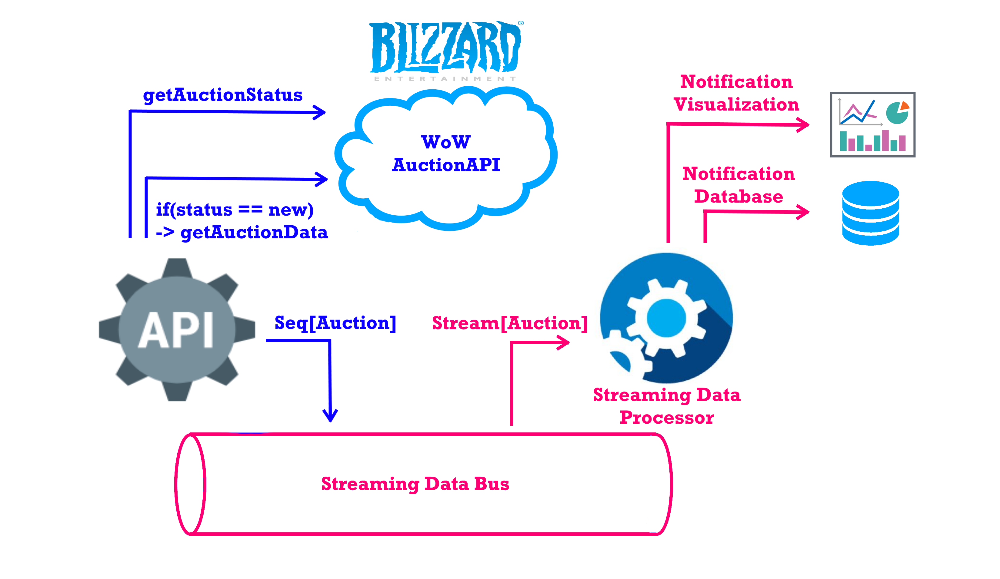

# Wow-Streaming-Auctioneer
Using the World of Warcraft auction data in a streaming fashion to gain market insights and be awesome.

## Project overview

The project is split up in two main components and a third that has the main case classes and
generic json parsing capabilities. Kafka is assumed to run in between, therefore the streaming application
and the kafkaloader do not have a direct connection.

## Getting Started

The project depends on a few technologies. SBT is the tool used to build/start/test the application. 
Read further for other necessary tools.

### Prerequisites

Technologies you need to install yourself:

```
SBT to build
Kafka (either local or a running cluster along with Zookeeper)
Elasticsearch and Kibana for visualization
```

### Installing

When the necessary tools are installed compile the project:

```
sbt compile
```
See deployment for further local demo.

## Code testing
```
sbt clean compile test
```

## Deployment

In order to actually run the application, run the following software (for windows):
```
kafka_2.12-1.0.0/bin/windows/zookeeper-server-start.bat
kafka_2.12-1.0.0/bin/windows/kafka-server-start.bat
elasticsearch-6.1.0/bin/elasticsearch.bat
kibana-6.1.0-windows-x86_64/bin/kibana.bat
```

or linux:
```
kafka_2.12-1.0.0/bin/zookeeper-server-start.sh
kafka_2.12-1.0.0/bin/kafka-server-start.sh
elasticsearch-6.1.0/bin/elasticsearch 
kibana-6.1.0/bin/kibana
```

Then start the auctionstreaming application: core.AuctionSparkApp
```
    sbt auctionstreaming/run
```
Followed by the kafkaloader application: core.ProducerApp
```
    sbt kafkaloader/run
```

Then after some time has passed data will start popping up @kibana by default: http://localhost:5601/

## Built With

* [SBT](http://www.scala-sbt.org/0.13/docs/index.html) - awesome build tool

## Architecture overview



## Github

https://github.com/jdekoning/StreamingAuctioneer

## License

This project is licensed under the MIT License - see the [LICENSE.md](LICENSE.md) file for details

